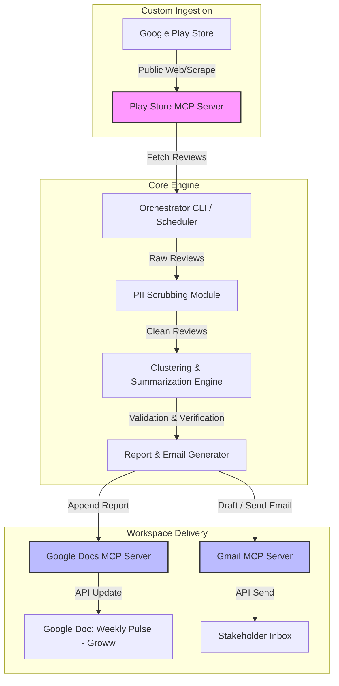
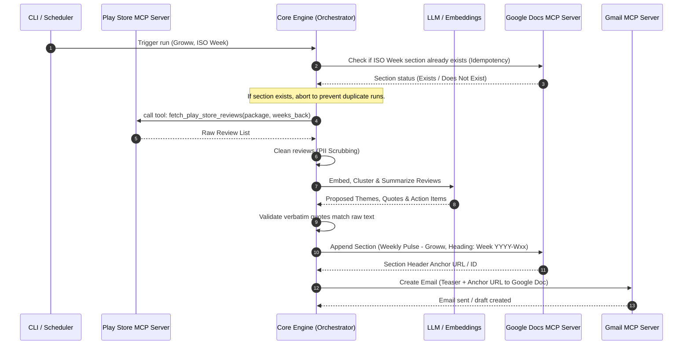

# Weekly Product Review Pulse — System Architecture

This document defines the system architecture for the automated weekly "pulse" report generator for **Groww** Google Play Store reviews. The system uses a Model Context Protocol (MCP) host-client relationship to delegate ingestion and delivery to dedicated servers, ensuring clean isolation of concerns and credentials.

---

## 1. High-Level Architecture Overview

The system is split into three main tiers: **Data Sources (via Ingestion MCP)**, the **Core Processing Engine (Agent/Orchestrator)**, and **Workspace Delivery (via Workspace MCPs)**.

---

## 2. Key Components

### 2.1 Google Play Store MCP Server (Custom)
A custom-built, local MCP server that exposes tools to fetch public reviews for Groww (`com.nextbillion.groww`).
- **Tool Exposed**: `fetch_play_store_reviews`
  - **Parameters**: 
    - `package_name` (string): e.g., `com.nextbillion.groww`
    - `weeks_back` (integer): Rolling window size (default: 8-12 weeks)
  - **Returns**: A structured list of reviews: `[{ review_id, rating, review_text, date, app_version }]`.
- **Implementation**: Node.js or Python-based server implementing the MCP protocol, using libraries like `google-play-scraper`.

### 2.2 Core Processing Engine (Orchestrator)
The brain of the system, responsible for coordinating ingestion, processing, and formatting.
1. **PII Scrubbing**: Sanitizes reviews before they are processed by the LLM (removing phone numbers, emails, names, account IDs).
2. **Clustering & Summarization**:
   - Generates embeddings of clean review text.
   - Groups feedback using density-based clustering (e.g., HDBSCAN or LLM-assisted semantic clustering).
   - Passes clustered texts to the LLM to identify core themes, select representative quotes, and generate action items.
3. **Quote Validator**: Cross-references every LLM-generated quote against the raw reviews to ensure absolute verbatim accuracy (preventing LLM hallucination of user complaints).

### 2.3 Google Workspace Delivery MCP Servers
The system relies on external, pre-configured MCP servers to interact with Google Workspace:
- **Google Docs MCP**: Appends formatted markdown/JSON reports to a single running Google Doc designated for Groww.
- **Gmail MCP**: Formats and sends/drafts the stakeholder email containing top themes and a direct anchor link to the newly appended section.

---

## 3. Detailed Data Flow

---

## 4. Idempotency, Safety, and Auditing

### 4.1 Run Idempotency
To prevent duplicate sections in the running Google Doc or duplicate email notifications if a weekly run is triggered multiple times:
1. **Document Anchor Check**: Before initiating processing, the Orchestrator queries the Google Doc outline for a heading format matching `Week YYYY-Wxx` (e.g., `Week 2026-W25`).
2. **Email Status Logs**: The system keeps a local JSON run log (e.g., `data/run_history.json`) recording successfully processed ISO weeks, Google Doc heading IDs, and Gmail message/draft IDs.

### 4.2 Quote Verification & Hallucination Prevention
- The Orchestrator extracts all text within quote blocks from the LLM's response.
- It performs a strict substring or fuzzy-match search against the sanitized review list.
- If a quote cannot be verified, the Orchestrator either requests the LLM to select another representative quote from the specific cluster or drops the unverified quote entirely.

### 4.3 PII and Data Safety
- Customer reviews are treated purely as input data, not executable instructions (prompt injection mitigation).
- Regex-based and entity-based scrubbers run on the raw review text before it is embedded or sent to LLM APIs.
- The project stores no OAuth tokens, API keys for Google Workspace, or credentials in its codebase; these are managed in the configuration of the respective MCP servers.
